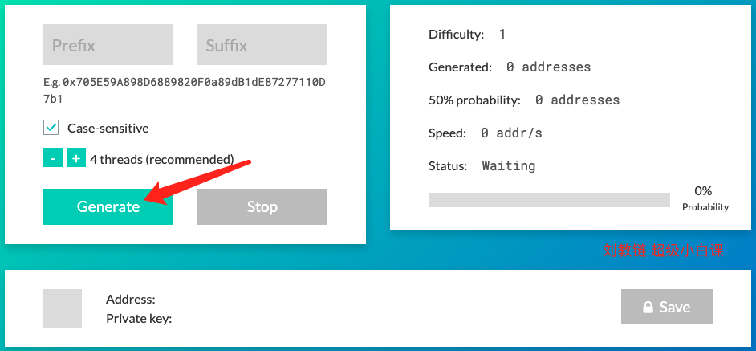
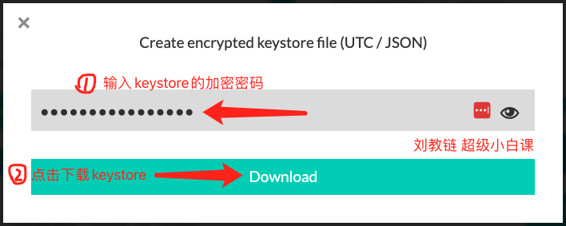

# 如何生成keystore

## 什么是keystore？

keystore是一种web3地址及其加密私钥的存储格式，由以太坊项目最早提出。

## 生成keystore总共分几步？

仅需三步：

一、浏览器打开网页生成工具[vanity-eth.tk](https://vanity-eth.tk/)

二、拉到页面最底端，点击【Generate(生成)】按钮

三、记下生成的Address(web3地址)，并点击【Save(保存)】按钮，输入一个加密密码（千万不能忘记），下载保存keystore文件（一定要妥善保管！）

