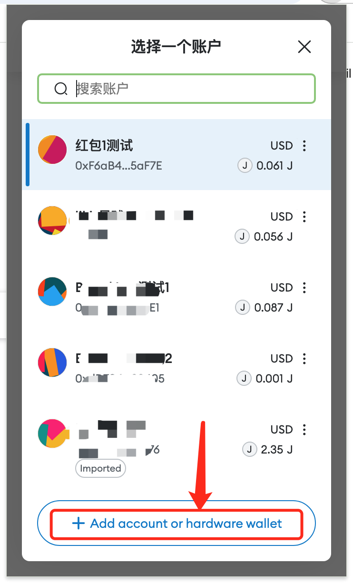

# 如何生成keystore并导入Metamask使用

<b>注意：课前填表只需要第一步生成keystore获得web3地址（链地址）用于填写登记表就可以了。不需要做后续的导入MetaMask等步骤（上课会具体再讲）。</b>

<b>相反的，如果你已经自行安装了MetaMask并抄写助记词，那么就直接使用助记词对应的账户地址填写学员登记表即可，不需要使用下面的网页工具来生成keystore地址了。</b>

## 什么是keystore？

keystore是一种web3地址及其加密私钥的存储格式，由以太坊项目最早提出。

## 生成keystore总共分几步？

仅需三步：

一、浏览器打开网页生成工具[vanity-eth.tk](https://vanity-eth.tk/)

二、拉到页面最底端，点击【Generate(生成)】按钮

三、记下生成的Address(web3地址)，并点击【Save(保存)】按钮，输入一个加密密码（千万不能忘记），下载保存keystore文件（一定要妥善保管！）

## 如何把keystore导入Metamask？

一、打开Metamask主界面，点击地址列表

二、点击最下方的添加账户或硬件钱包

三、点击导入账户

四、选择类型，切换为JSON文件（即keystore文件）

五、点击选择文件

六、输入keystore密码

七、稍等片刻，导入成功，检查地址是否与keystore地址一致，确系自己希望导入的地址

## 如何在Metamask中切换网络？

以 Jouleverse 为例

一、点击Metamask主界面左上角网络列表

二、点击下方添加网络

三、点击手动添加网络

四、依次输入各项信息（参考[第3次课预习材料](../course3/course3-prep.md)中，Jouleverse网络接入点信息），点击保存

五、添加成功，点击切换至Jouleverse

## 如何在Metamask中显示某地址下的代币？

以 WJ 代币为例

一、确认网络已切换到Jouleverse。地址已切换到正确的地址。点击界面下方的添加代币

二、输入WJ代币的合约地址（查看[第3次课预习材料](../course3/course3-prep.md)中，Jouleverse常用资产地址）。稍等片刻，应该会自动探测到正确的符号(WJ)和精度(18)。点击下一步

三、再次确认。点击导入

四、导入成功

